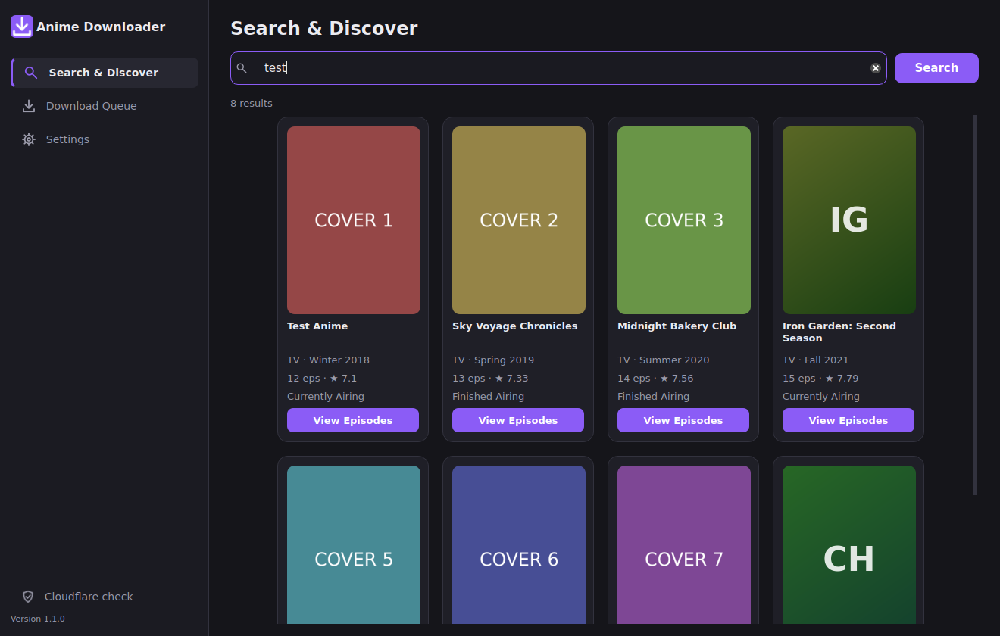
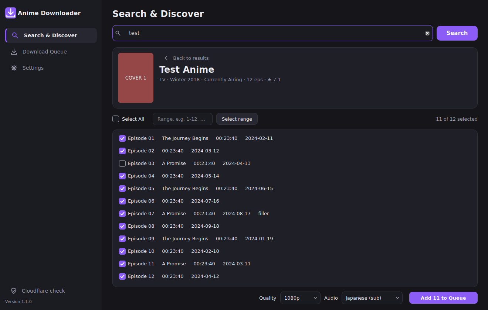
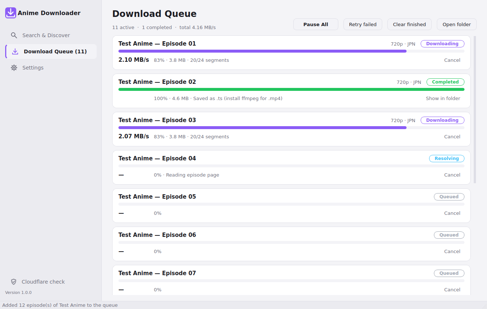

# Anime Downloader (AnimePahe) for Windows 11

A desktop app that searches [AnimePahe](https://animepahe.pw), lists every episode of a show and
downloads the episodes you pick, several at a time, as `.mp4` files.



## Features

- **Search** by title, or paste an anime link (`https://animepahe.pw/anime/<id>`).
- **Episode list** with checkboxes, *Select all*, and range selection such as `1-12, 15, 20-`.
- **Quality and audio** preferences: 1080p / 720p / 480p / 360p, Japanese (sub) or English (dub).
  The best source at or below your quality is picked, and the app falls back to sub when no dub exists.
- **Fast downloads.** Several episodes run in parallel, and each episode uses several connections.
- **Resume.** Finished pieces are kept, so an interrupted download continues where it stopped.
- **MP4 output** through ffmpeg. Without ffmpeg the video is saved as `.ts`, which VLC and MPV play.
- **Cloudflare handling.** A built-in browser window lets you pass the "Verify you are human" check.
  The app then reuses that browser's cookie and User-Agent.
- **Japanese title lookup.** Type an English title and click **日本語** (or run `cli japanese "…"`)
  to get its Japanese title from MyAnimeList, through the free Jikan API.
- **Rename to Japanese.** Turn on *Rename file and folder to the Japanese title* in Settings (or pass
  `--japanese-names` to `cli download`). You still search AnimePahe in English; once an episode finishes,
  its file and folder are renamed to the Japanese title. If MyAnimeList has no match, the English name is kept.
- Light and dark mode that follows Windows. There is also a command-line mode for scripting.

## Install

### Option 1: download the ready-made .exe

1. On GitHub, open **Actions → Build Anime Downloader (Windows)** and pick the latest green run.
   You can also start one with **Run workflow**.
2. Download the **AnimePaheDL-windows-x64** artifact and unzip it anywhere.
3. Run `AnimePaheDL.exe`. Windows SmartScreen may warn because the app is unsigned.
   Choose **More info → Run anyway**.

### Option 2: build it yourself

Install Python 3.10 or newer (`winget install Python.Python.3.12`), then double-click `build.bat`,
or run it from a terminal:

```bat
build.bat
```

The app ends up in `dist\AnimePaheDL\AnimePaheDL.exe`. To run from source without building,
use `run.bat` or `python run.py`.

### Recommended: ffmpeg for .mp4 files

```bat
winget install Gyan.FFmpeg
```

The app finds ffmpeg on `PATH`, in the winget install folder, or next to `AnimePaheDL.exe`.
You can also point to `ffmpeg.exe` in **Settings**.

## How to use

The sidebar on the left has three sections: **Search & Discover**, **Download Queue** and **Settings**.

1. **Search & Discover.** Type a title and press **Enter** or **Search**. Results appear as cards with
   cover art, title, release season, episode count and score.
2. Click **View Episodes** on a card. The episode panel lists every episode with a checkbox.
   Use **Select All**, click individual rows, or type a range and press **Select range**.
3. Pick quality and audio, then click **Add N to Queue**. The app switches to the queue.
4. **Download Queue.** Each episode has its own progress bar, live speed in MB/s and a status:
   Queued, Resolving, Downloading, Stitching via FFmpeg, Completed or Failed.
   **Pause All** holds every download and turns into **Resume All**. Rows also offer
   Cancel, Retry and Show in folder.
5. **Settings.** Set the download folder, file-name pattern, default quality and audio, how many
   episodes run at once, the ffmpeg location, and the site address.





Files are saved to `Videos\Anime\<Anime title>\<Anime title> - Episode 01.mp4` by default.
The file-name pattern accepts `{anime}`, `{episode}`, `{quality}`, `{audio}` and `{title}`.

### The "Verify in browser" window

AnimePahe sits behind Cloudflare. When the site asks for a check, the app opens a browser
window on its own. Complete the check and the window closes by itself. Downloads that were
blocked are then retried. You can open this window at any time with **Cloudflare check** in the
sidebar or **Verify in browser** in Settings.

If the check keeps failing, use **Enter cookie manually…**. In Chrome or Edge, open the site,
press F12, go to Application → Cookies, and copy `cf_clearance`. Then copy the browser's
User-Agent by typing `navigator.userAgent` in the Console. Both values must come from the same
browser on the same network.

### When the site changes its address

AnimePahe moves between domains from time to time (`.pw`, `.si`, `.ru`, `.com`, …).
Put the current address in **Settings → Site address**.

## Command line

The same `.exe` has a command-line mode:

```bat
AnimePaheDL.exe cli search "frieren"
AnimePaheDL.exe cli download "https://animepahe.pw/anime/<id>" -e 1-12 -q 1080 -a jpn -o D:\Anime
AnimePaheDL.exe cli download "frieren" -e 5- -q 720 --cookie cf_clearance=... --user-agent "Mozilla/5.0 ..."
```

## How it works

1. The app calls `/api?m=search` to search and `/api?m=release` to list episodes.
   The episode list comes back in pages, and the app fetches all of them.
2. The episode page (`/play/<anime>/<episode>`) lists the available sources as kwik player
   links, each with a resolution, an audio language and an AV1 flag.
3. The kwik page hides the stream address inside packed JavaScript
   (`eval(function(p,a,c,k,e,d)…)`). The app unpacks it in Python, without running any
   JavaScript, and finds the `.m3u8` playlist.
4. The HLS segments are downloaded in parallel and decrypted with AES-128. They are joined
   into one file, then remuxed to `.mp4` with ffmpeg without re-encoding.

Settings and the browser profile live in `%APPDATA%\AnimePaheDL`.

## Project layout

| Path | What it does |
| --- | --- |
| `animepahe_dl/animepahe.py` | Site API client: search, episodes, source scraping and selection |
| `animepahe_dl/mal.py` | English title → Japanese title lookup on MyAnimeList (Jikan API) |
| `animepahe_dl/kwik.py` | JavaScript unpacker and playlist extraction |
| `animepahe_dl/hls.py` | HLS parser and parallel AES-128 segment downloader with resume |
| `animepahe_dl/downloader.py` | Download queue, parallel episodes, ffmpeg remux |
| `animepahe_dl/http.py` | HTTP client with Chrome TLS impersonation, retries and challenge detection |
| `animepahe_dl/gui/` | PySide6 (Qt 6) interface: sidebar window, search/queue/settings pages, cards, theme, verification browser |
| `animepahe_dl/cli.py` | Command-line interface |
| `tests/` | Unit tests plus an offline end-to-end test against a fake local site |

Run the tests with `python -m pytest -q`.

## Troubleshooting

- **The Cloudflare check keeps repeating.** In the check window, click **Reset browser data** and pass
  the check again. Turn off any VPN or proxy. If it still loops, click **Enter cookie manually** and copy
  `cf_clearance` and the User-Agent from Chrome or Edge. If the check also loops in your normal browser,
  the site is under heavy protection at the moment, so wait and try later.
- **"… answered with a web page … instead of AnimePahe search data."** The Site address points to a
  look-alike site that uses the AnimePahe name, for example animepahe.ch. Set it to the real address,
  currently `https://animepahe.pw`, and use **Test** next to Site address in Settings to confirm it works.
- **"The site is asking for a Cloudflare/DDoS-Guard browser check."** Click **Cloudflare check** in the sidebar.
  Cloudflare cookies expire, and they also stop working when your IP changes.
- **"No video sources found."** The site layout or address has probably changed.
  Check the address in Settings.
- **Files end in `.ts`.** ffmpeg was not found. Install it as shown above.
- **Downloads are slow or fail with HTTP 429.** Lower *Episodes at once* and
  *Connections per episode* in Settings.

## Disclaimer

This tool is meant for personal use. Only download content you have the right to access, and
follow the laws of your country and the site's terms of service.
